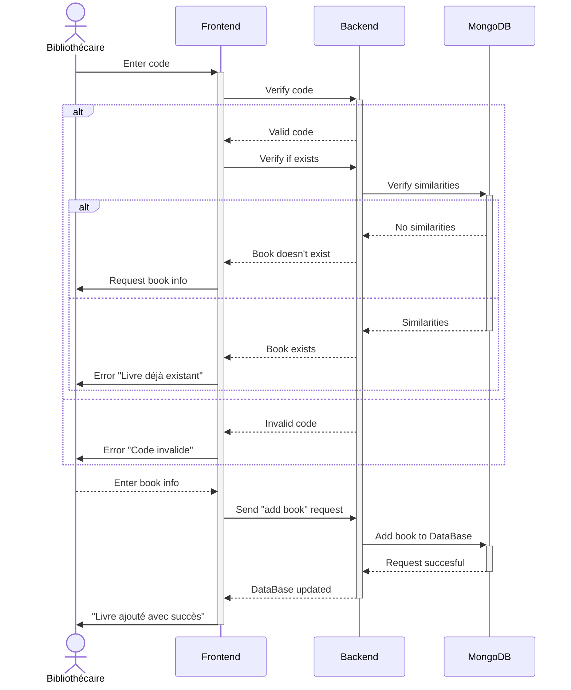
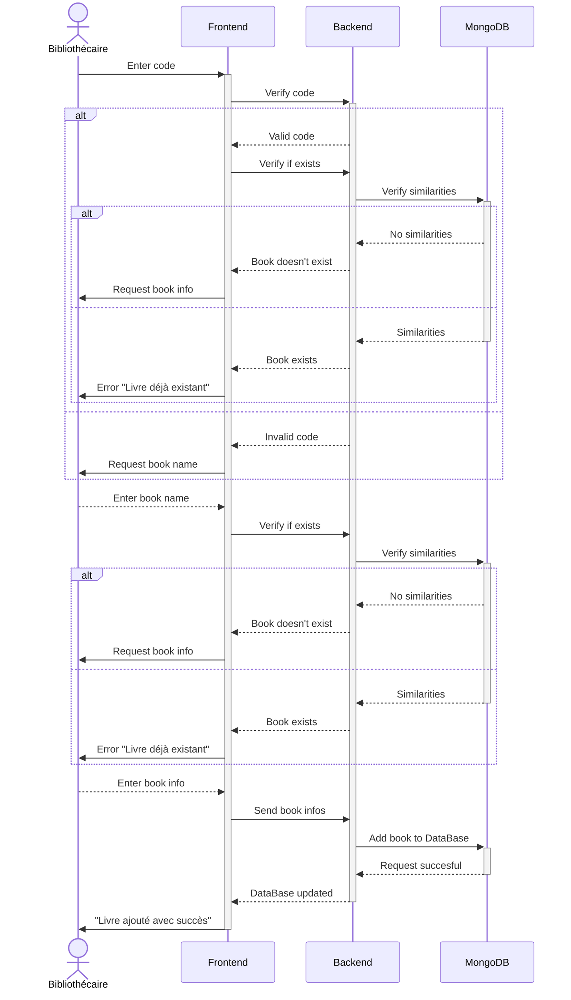

## Introduction à la Modification du Système de Gestion des Livres

Notre proposition de modification du système de gestion des livres simplifie le processus d'ajout en introduisant une condition clé. Désormais, lors de l'entrée d'un code ISBN, au lieu de générer une erreur immédiate, le système **demande à l'utilisateur de fournir un titre associé**. Cette modification stratégique permet au système de basculer vers une recherche basée sur le titre plutôt que sur l'ISBN, évitant ainsi les obstacles posés par l'absence de ce dernier, en particulier pour les livres plus anciens. Nous croyons que cette solution offre une approche plus souple et intuitive tout en préservant l'intégrité de notre base de données. Avant d'implémenter ce changement, nous sollicitons vos avis pour garantir son efficacité et son acceptation par l'équipe.

### Diagramme séquence: actuel

### Diagramme séquence: suggéré

### Diagramme use-case: suggéré

