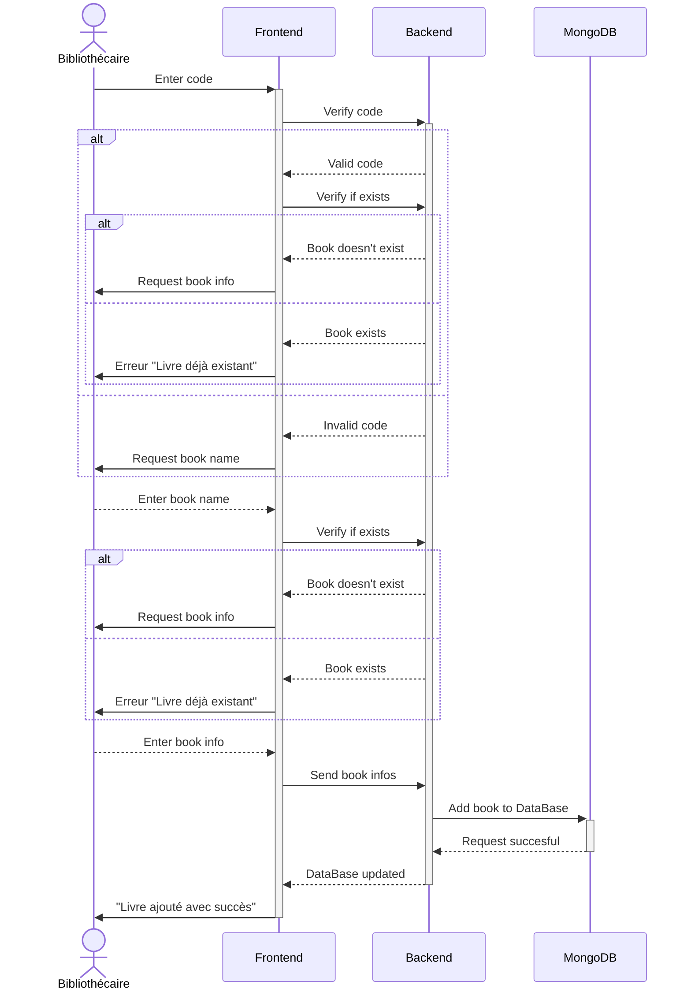

### Diagramme séquence: suggéré

```mermaid
sequenceDiagram
actor Bibliothécaire
    Bibliothécaire->>+Frontend: Enter code
    Frontend->>+Backend: Verify code

    alt
        Backend-->>Frontend: Valid code
        Frontend->>Backend: Verify if exists

        alt
        Backend-->>Frontend: Book doesn't exist
        Frontend->>Bibliothécaire: Request book info

        else
        Backend-->>Frontend: Book exists
        Frontend->>Bibliothécaire: Erreur "Livre déjà existant"
        end
    else
        Backend-->>Frontend: Invalid code
        Frontend->>Bibliothécaire: Request book name
    end

    Bibliothécaire-->>Frontend: Enter book name
    Frontend->>Backend: Verify if exists

    alt
        Backend-->>Frontend: Book doesn't exist
        Frontend->>Bibliothécaire: Request book info

        else
        Backend-->>Frontend: Book exists
        Frontend->>Bibliothécaire: Erreur "Livre déjà existant"
        end

    Bibliothécaire-->>Frontend: Enter book info
    Frontend->>Backend: Send book infos
    Backend->>+MongoDB: Add book to DataBase
    MongoDB-->>-Backend: Request succesful
    Backend-->>-Frontend: DataBase updated
    Frontend->>-Bibliothécaire: "Livre ajouté avec succès"
```
